## 1.  CEL DOKUMENTU

Niniejszy dokument zawiera raport z testów funkcjonalnych i akceptacyjnych aplikacji. Celem przeprowadzonych testów było sprawdzenie poprawności działania podstawowych funkcjonalności systemu, weryfikacja poprawności obsługi operacji finansowych oraz potwierdzenie zgodności implementacji z wymaganiami określonymi w dokumentacji projektowej. 

## 2. ZAKRES TESTÓW

Przeprowadzone testy obejmowały:

rejestrację użytkownika,
logowanie do systemu,
dodawanie przychodów,
dodawanie wydatków,
walidację formularzy,
edycję transakcji,
wyświetlanie historii operacji,
usuwanie transakcji,
aktualizację statystyk i wykresów,
wylogowanie użytkownika.

## 3. TESTY

**Cel testu:** Weryfikacja procesu utworzenia nowego konta użytkownika.

**Warunki wstępne:** Użytkownik nie posiada konta w systemie.

**Scenariusz główny:**

1. Użytkownik otwiera formularz rejestracji.
2. Wprowadza login użytkownika.
3. Wprowadza hasło.
4. Klika przycisk „Dodaj użytkownika”.

**Oczekiwany rezultat:**

- konto użytkownika zostaje utworzone,
- system wyświetla komunikat „Użytkownik dodany poprawnie”,
- użytkownik może przejść do strony logowania.

**Wynik testu:** PASS

**Dokumentacja wizualna:**

Rysunek 1. Formularz dodawania nowego użytkownika.

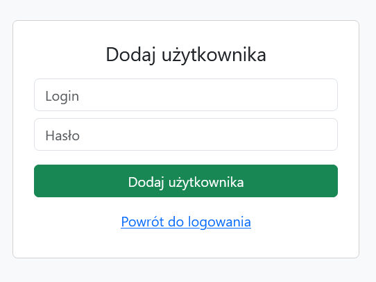

Rysunek 2. Formularz rejestracji z wprowadzonymi danymi.

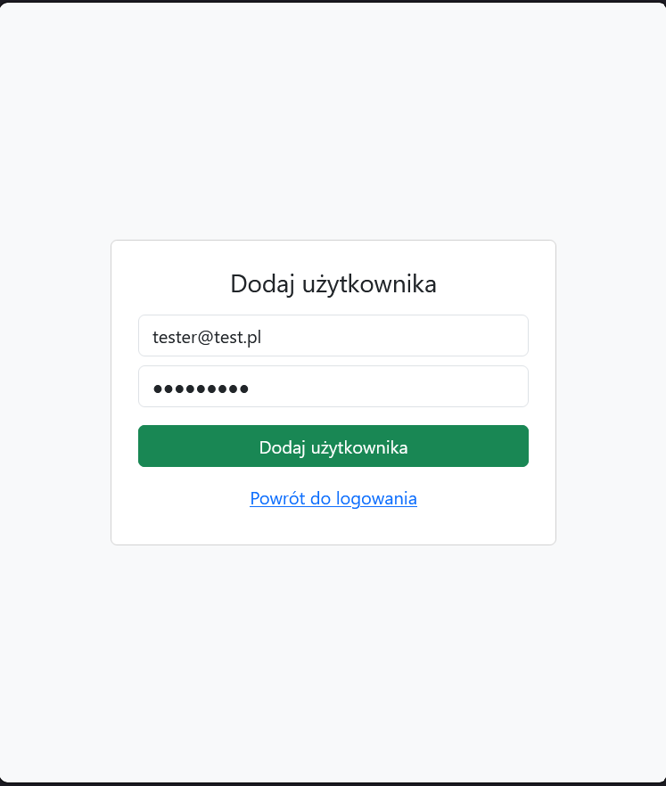

Rysunek 3. Komunikat potwierdzający poprawną rejestrację.

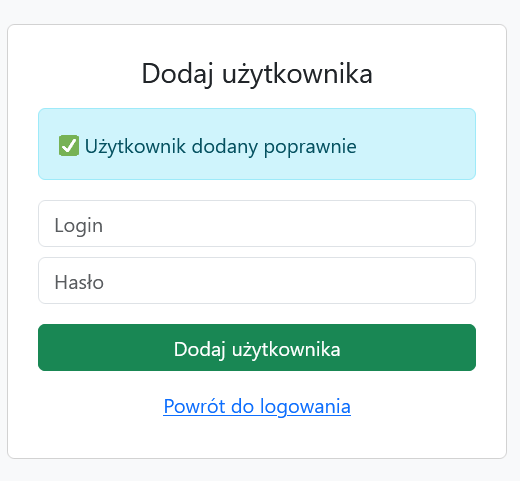

---

## TC-02 – Logowanie użytkownika

**Cel testu:** Weryfikacja poprawnego procesu logowania.

**Warunki wstępne:** Użytkownik posiada konto w systemie.

**Scenariusz główny:**

1. Użytkownik otwiera stronę logowania.
2. Wprowadza login i hasło.
3. Klika przycisk „Zaloguj się”.

**Oczekiwany rezultat:**

- użytkownik zostaje poprawnie zalogowany,
- system przekierowuje użytkownika do panelu głównego aplikacji.

**Wynik testu:** PASS

**Dokumentacja wizualna:**

Rysunek 4. Strona logowania przed wprowadzeniem danych.

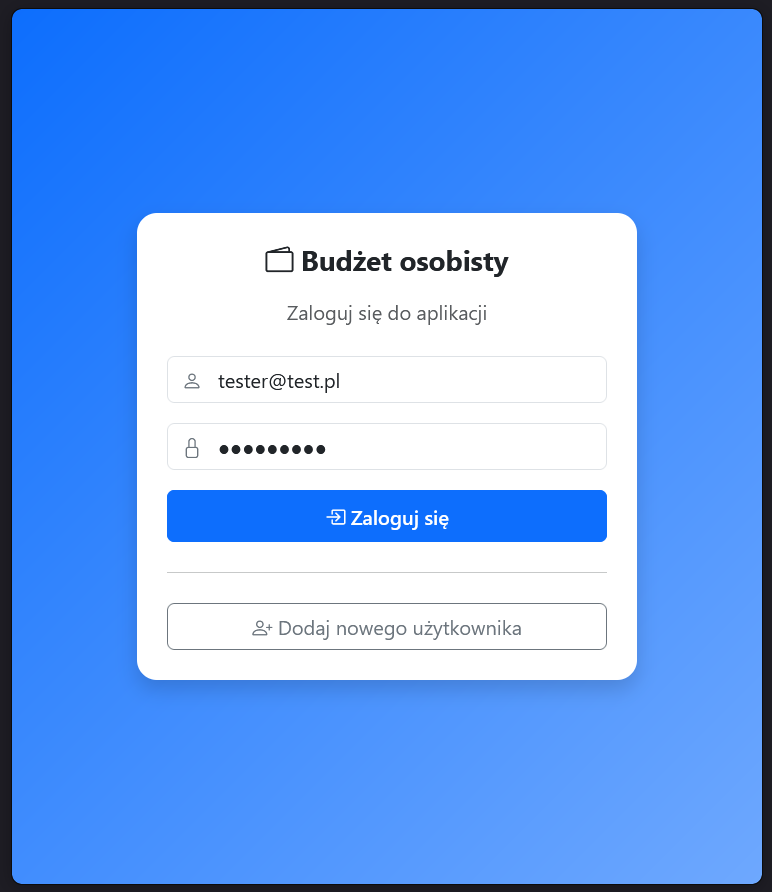

Rysunek 5. Formularz logowania z wprowadzonymi danymi użytkownika.

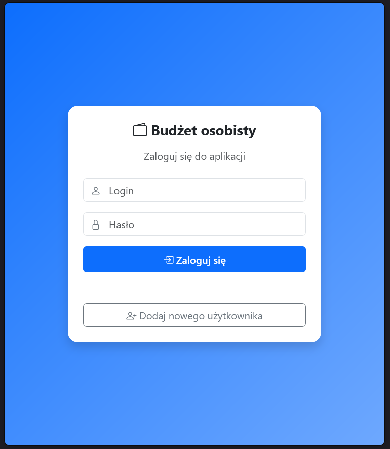

---

## TC-03 – Dodanie przychodu

**Cel testu:** Weryfikacja procesu dodawania nowej operacji typu „Przychód”.

**Warunki wstępne:** Użytkownik jest zalogowany.

**Scenariusz główny:**

1. Użytkownik wybiera typ operacji „Przychód”.
2. Wprowadza tytuł „Wypłata”.
3. Wprowadza opis „Pensja”.
4. Wprowadza kwotę „10000”.
5. Klika przycisk „Dodaj”.

**Oczekiwany rezultat:**

- operacja zostaje zapisana,
- historia operacji zostaje zaktualizowana,
- wartość przychodów wynosi 10000,00 PLN,
- wykres finansowy zostaje odświeżony.

**Wynik testu:** PASS

**Dokumentacja wizualna:**

Rysunek 6. Formularz dodawania przychodu przed zapisaniem danych.

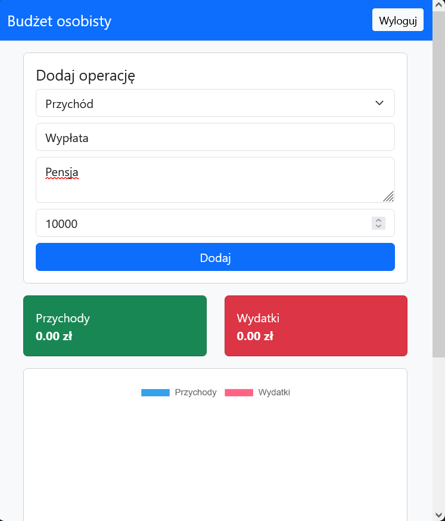

Rysunek 7. Widok systemu po zapisaniu przychodu.

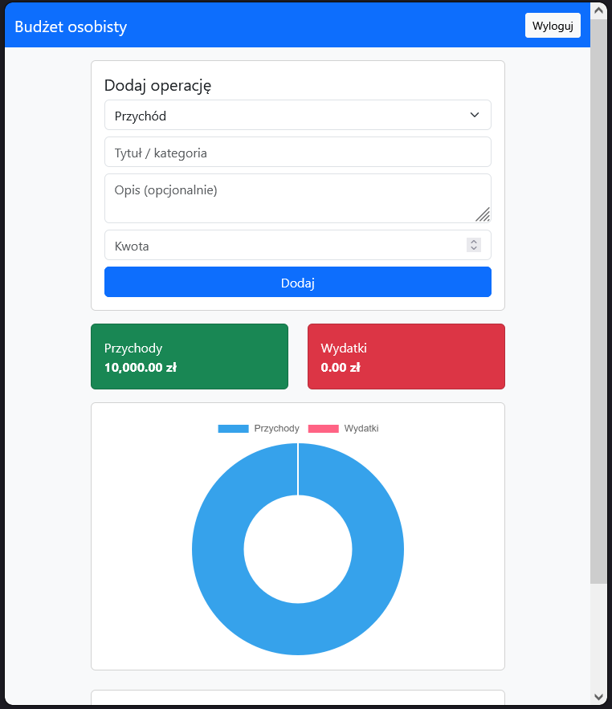

---

## TC-04 – Walidacja formularza dodawania operacji

**Cel testu:** Weryfikacja poprawności walidacji wymaganych pól formularza.

**Warunki wstępne:** Użytkownik jest zalogowany.

**Scenariusz główny:**

1. Użytkownik pozostawia pole „Tytuł / kategoria” puste.
2. Klika przycisk „Dodaj”.

**Oczekiwany rezultat:**

- operacja nie zostaje zapisana,
- system wyświetla komunikat „Proszę wypełnić to pole”.

**Wynik testu:** PASS

**Dokumentacja wizualna:**

Rysunek 8. Komunikat walidacyjny formularza.

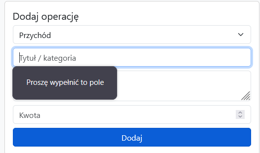

---

## TC-05 – Dodanie wydatku

**Cel testu:** Weryfikacja procesu dodawania nowej operacji typu „Wydatek”.

**Warunki wstępne:** Użytkownik jest zalogowany.

**Scenariusz główny:**

1. Użytkownik wybiera typ operacji „Wydatek”.
2. Wprowadza tytuł „Zakupy”.
3. Wprowadza kwotę „319,59”.
4. Klika przycisk „Dodaj”.

**Oczekiwany rezultat:**

- wydatek zostaje zapisany,
- historia operacji zostaje zaktualizowana,
- wartość wydatków wynosi 319,59 PLN,
- wykres finansowy zostaje odświeżony.

**Wynik testu:** PASS

**Dokumentacja wizualna:**

Rysunek 9. Formularz dodawania wydatku przed zapisaniem danych.

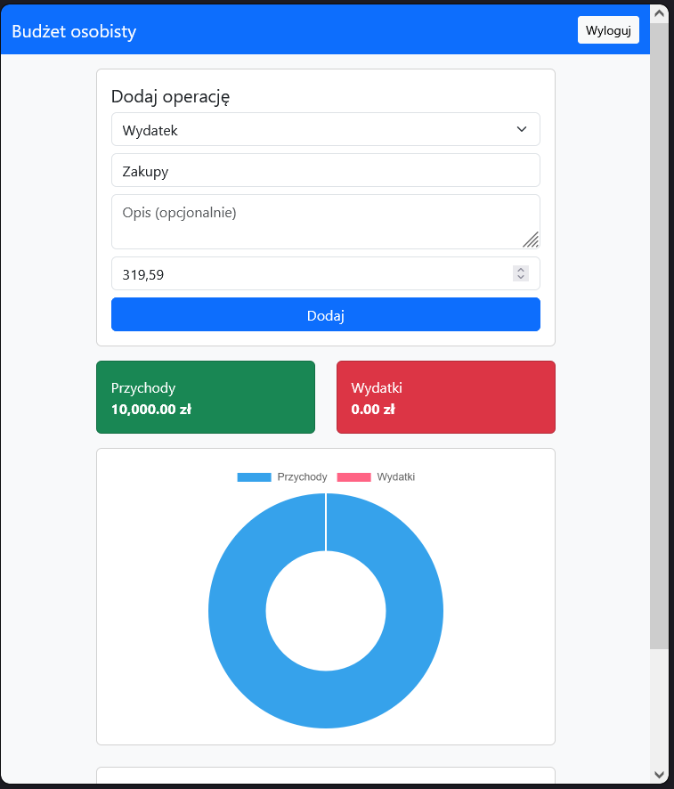

Rysunek 10. Widok systemu po zapisaniu wydatku.

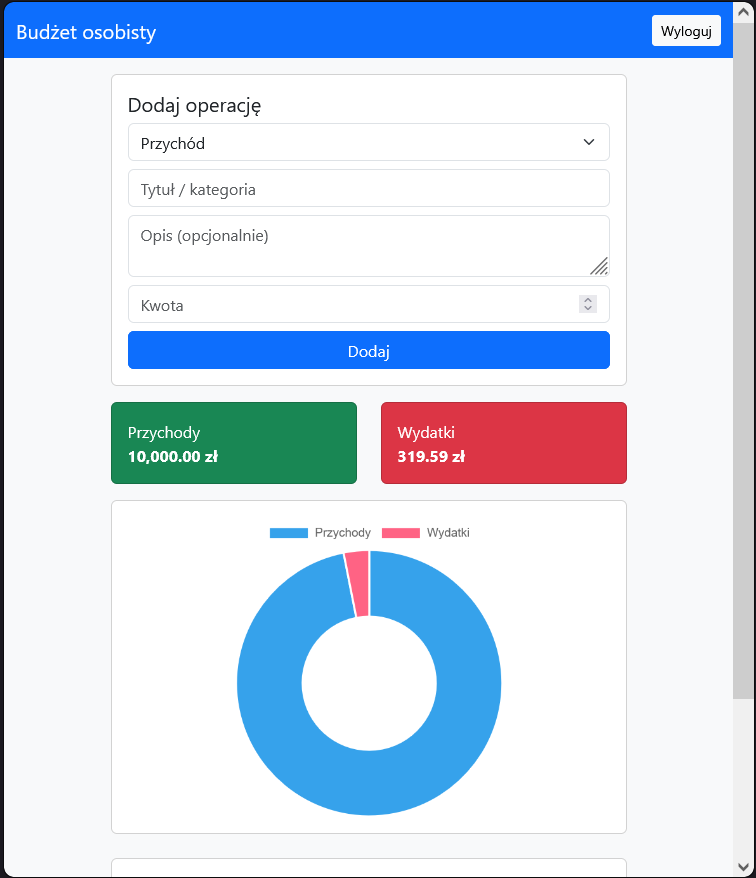

---

## TC-06 – Edycja transakcji

**Cel testu:** Weryfikacja możliwości modyfikacji istniejącej operacji.

**Warunki wstępne:** W systemie istnieje zapisany przychód.

**Scenariusz główny:**

1. Użytkownik wybiera opcję edycji operacji.
2. Zmienia kwotę przychodu z 10000,00 PLN na 9000,00 PLN.
3. Zapisuje zmiany.

**Oczekiwany rezultat:**

- dane operacji zostają zaktualizowane,
- suma przychodów wynosi 9000,00 PLN,
- historia operacji zostaje zaktualizowana,
- wykres finansowy zostaje ponownie przeliczony.

**Wynik testu:** PASS

**Dokumentacja wizualna:**

Rysunek 11. Formularz edycji operacji.

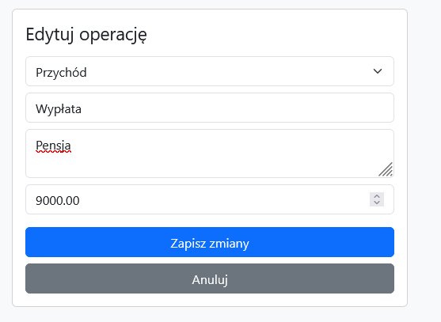

Rysunek 12. Widok systemu po zapisaniu zmian.

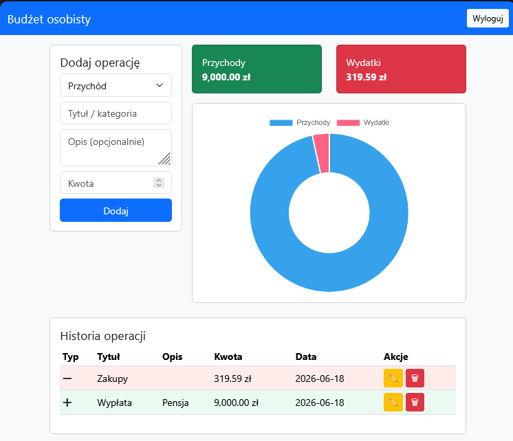

---

## TC-07 – Historia operacji

**Cel testu:** Weryfikacja poprawności wyświetlania zapisanych operacji.

**Warunki wstępne:** W systemie istnieją zapisane operacje finansowe.

**Scenariusz główny:**

1. Użytkownik przechodzi do sekcji „Historia operacji”.
2. Weryfikuje wyświetlane dane.

**Oczekiwany rezultat:**

- system wyświetla wszystkie zapisane operacje,
- prezentowane są dane dotyczące typu, tytułu, opisu, kwoty, daty oraz dostępnych akcji.

**Wynik testu:** PASS

**Dokumentacja wizualna:**

Rysunek 13. Historia operacji.

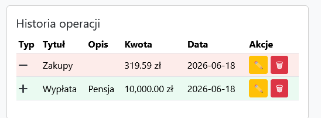

---

## TC-08 – Usunięcie transakcji

**Cel testu:** Weryfikacja procesu usuwania operacji.

**Warunki wstępne:** W systemie istnieje zapisany wydatek.

**Scenariusz główny:**

1. Użytkownik wybiera opcję usunięcia operacji.
2. System wyświetla okno potwierdzenia.
3. Użytkownik zatwierdza usunięcie.

**Oczekiwany rezultat:**

- operacja zostaje usunięta,
- historia operacji zostaje zaktualizowana,
- wartość wydatków zostaje przeliczona,
- wykres finansowy zostaje odświeżony.

**Wynik testu:** PASS

**Dokumentacja wizualna:**

Rysunek 14. Historia operacji przed usunięciem.

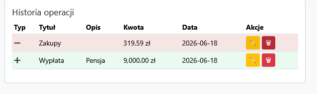

Rysunek 15. Okno potwierdzenia usunięcia operacji.

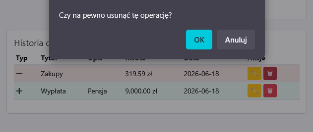

Rysunek 16. Widok systemu po usunięciu operacji.

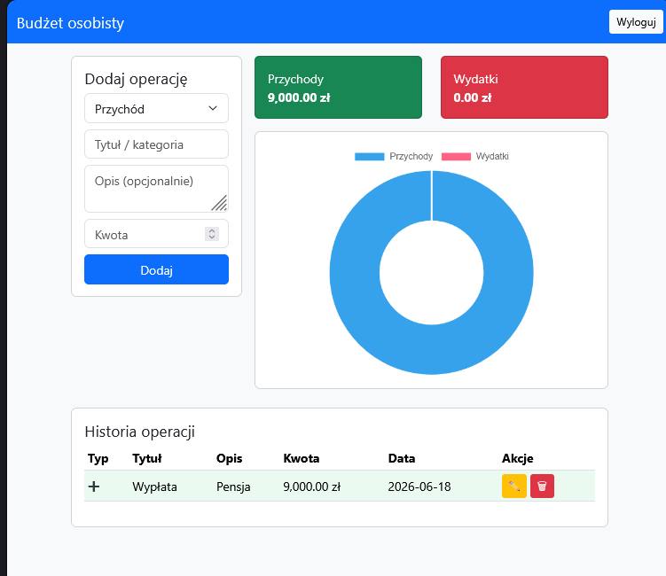

---

## TC-09 – Wylogowanie użytkownika

**Cel testu:** Weryfikacja poprawnego zakończenia sesji użytkownika.

**Warunki wstępne:** Użytkownik jest zalogowany.

**Scenariusz główny:**

1. Użytkownik wybiera opcję „Wyloguj”.

**Oczekiwany rezultat:**

- sesja użytkownika zostaje zakończona,
- następuje przekierowanie do strony logowania,
- użytkownik nie ma dostępu do funkcji aplikacji bez ponownego zalogowania.

**Wynik testu:** PASS

**Dokumentacja wizualna:**

Rysunek 17. Widok panelu przed wylogowaniem.

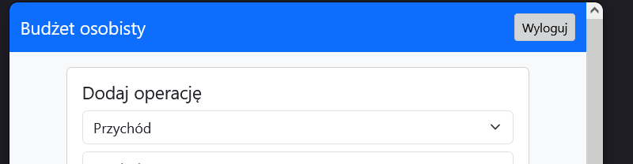

Rysunek 18. Widok strony logowania po wylogowaniu.

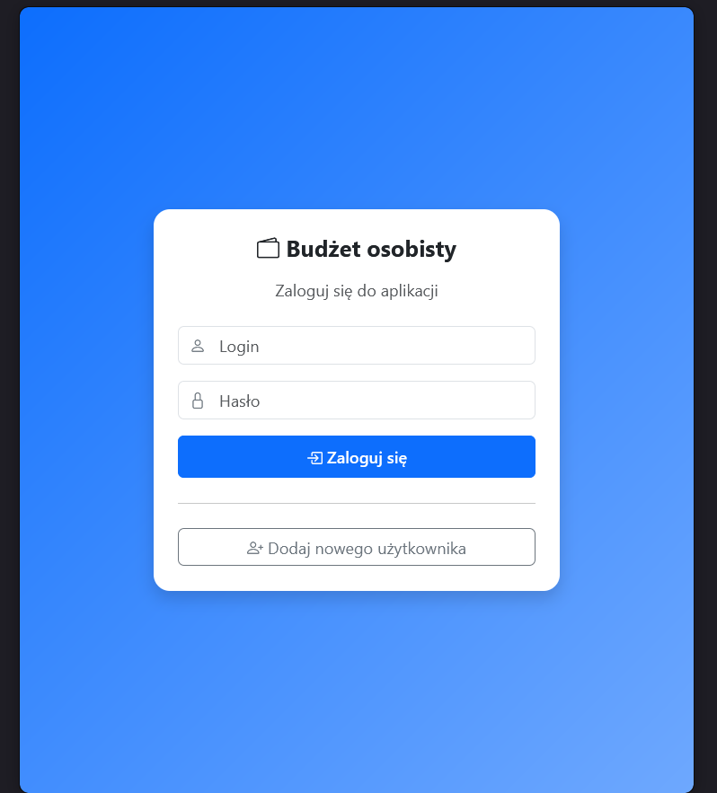

## 4. PODSUMOWANIE TESTÓW

| ID | Nazwa testu | Status |
|----|--------------|---------|
| TC-01 | Rejestracja nowego użytkownika | PASS |
| TC-02 | Logowanie użytkownika | PASS |
| TC-03 | Dodanie przychodu | PASS |
| TC-04 | Walidacja formularza | PASS |
| TC-05 | Dodanie wydatku | PASS |
| TC-06 | Edycja transakcji | PASS |
| TC-07 | Historia operacji | PASS |
| TC-08 | Usunięcie transakcji | PASS |
| TC-09 | Wylogowanie użytkownika | PASS |

## 5. WNIOSKI

Przeprowadzone testy potwierdziły poprawne działanie podstawowych funkcjonalności aplikacji. Wszystkie wykonane scenariusze testowe zakończyły się wynikiem pozytywnym (PASS).

Zweryfikowano poprawność działania mechanizmów rejestracji i logowania użytkownika, obsługę operacji finansowych (dodawanie, edycję oraz usuwanie transakcji), walidację formularzy oraz poprawną aktualizację statystyk i wykresów prezentujących stan budżetu użytkownika.

System poprawnie wyświetla historię operacji, umożliwia zarządzanie przychodami i wydatkami oraz zapewnia bezpieczne zakończenie sesji użytkownika poprzez wylogowanie. Na podstawie przeprowadzonych testów można stwierdzić, że aplikacja spełnia wymagania funkcjonalne określone w dokumentacji projektowej i jest gotowa do dalszego rozwoju.